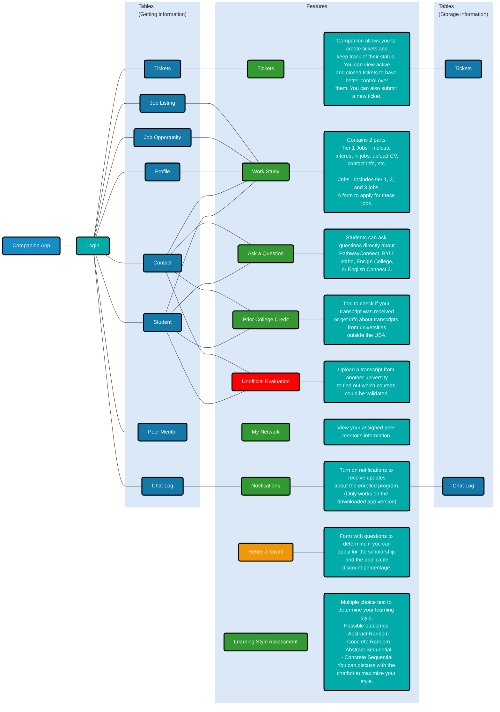

```mermaid
flowchart LR
  A[Companion App] --- B[Login]

%% Subgraphs
subgraph T1 ["Tables \n(Getting information)"]
1
C[Tickets]
D[Job Listing]
E[Job Opportunity]
F[Profile]
G[Contact]
H[Student]
I[Peer Mentor]
J[Chat Log]          
end                   

subgraph Features
2
    K[Tickets]
    Ki["Companion allows you to create tickets and\nkeep track of their status. You can view active\nand closed tickets to have better control over\nthem. You can also submit a new ticket."]
    
    L[Work Study]
    Li["Contains 2 parts:\nTier 1 Jobs - Indicate interest in jobs, upload CV,\ncontact info, etc.\n\nJobs - Includes tier 1, 2, and 3 jobs.\nA form to apply for these jobs."]
    
    M[Ask a Question]
    Mi["Students can ask questions directly about\nPathwayConnect, BYU-Idaho, Ensign College,\nor English Connect 3."]
    
    N[Prior College Credit]
    Ni["Tool to check if your transcript was received\nor get info about transcripts from universities\noutside the USA."]
    
    O[Unofficial Evaluation]
    Oi["Upload a transcript from another university\nto find out which courses could be validated."]
    
    P[My Network]
    Pi["View your assigned peer mentor's information."]
    
    Q[Notifications]
    Qi["Turn on notifications to receive updates\nabout the enrolled program.\n(Only works on the downloaded app version)"]
    
    R[Heber J. Grant]
    Ri["Form with questions to determine if you can\napply for the scholarship and the applicable\ndiscount percentage."]
    
    S[Learning Style Assessment]
    Si["Multiple choice test to determine your learning style.\nPossible outcomes:\n- Abstract Random\n- Concrete Random\n- Abstract Sequential\n- Concrete Sequential\nYou can discuss with the chatbot to maximize your style."]
end

subgraph T2 ["Tables \n(Storage information)"]
3
    T[Tickets]
    U[Chat Log]
end

%% Connections
  1 -.- 2 -.- 3
  B --- C & D & E & F & G & H & I & J
  C --- K
  D & E & F & G --- L
  G --- M & N & O
  H --- L & M & N & O
  I --- P
  J --- Q

  K --- Ki --- T
  L --- Li
  M --- Mi
  N --- Ni
  O --- Oi
  P --- Pi
  R --- Ri
  S --- Si
  Q --- Qi --- U

%% Style Definitions
classDef titleStyle fill:#168DC7,color:#FFF,stroke-width:3px,stroke:#000,rx:5,ry:5
classDef informationStyle fill:#00aba9,color:#FFF,stroke-width:3px,stroke:#000,rx:5,ry:5
classDef subgraphsStyles fill:#dae8f7,stroke:#dae8f7,stroke-width:5px
classDef tableStyle fill:#1478a9,color:#FFF,stroke-width:3px,stroke:#000,rx:5,ry:5
classDef activeStyle fill:#339933,color:#FFF,stroke-width:3px,stroke:#000,rx:5,ry:5
classDef inProgressStyle fill:#f09609,color:#FFF,stroke-width:3px,stroke:#000,rx:5,ry:5
classDef deprecatedStyle fill:#ff0000,color:#FFF,stroke-width:3px,stroke:#000,rx:5,ry:5
classDef alignStyle color:#dae8f7,stroke:#dae8f7, width:0px, height: 0px

%% Style Assignments
T1:::subgraphsStyles
T2:::subgraphsStyles
Features:::subgraphsStyles

1:::alignStyle
2:::alignStyle
3:::alignStyle
linkStyle 1 stroke-width:0
linkStyle 2 stroke-width:0

A:::titleStyle
B:::informationStyle

C:::tableStyle
D:::tableStyle
E:::tableStyle
F:::tableStyle
G:::tableStyle
H:::tableStyle
I:::tableStyle
J:::tableStyle
T:::tableStyle
U:::tableStyle

K:::activeStyle
L:::activeStyle
M:::activeStyle
N:::activeStyle
O:::deprecatedStyle
P:::activeStyle
Q:::activeStyle
R:::inProgressStyle
S:::activeStyle

Ki:::informationStyle
Li:::informationStyle
Mi:::informationStyle
Ni:::informationStyle
Oi:::informationStyle
Pi:::informationStyle
Qi:::informationStyle
Ri:::informationStyle
Si:::informationStyle
```
